# EasyRent_Front

### 一个提供在校学生和老师发布租赁商品信息的平台。

[EasyRent_Server](https://github.com/cenganhui/EasyRent_Server)

## 主要功能
- 用户注册登录
- 显示平台中租赁商品信息
- 根据商品标题搜索商品
- 订单模块
- 发布商品和查看已发布商品
- 商品收藏
- 个人信息修改
- 聊天模块

## 注册
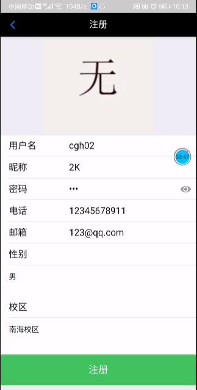
## 登录

## 主页面
#### 下拉刷新、上拉加载、广告轮播、搜索商品
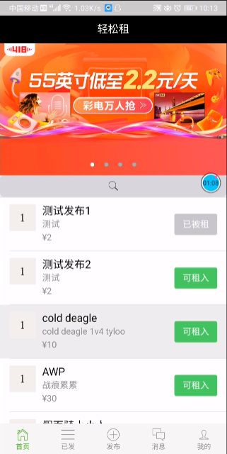
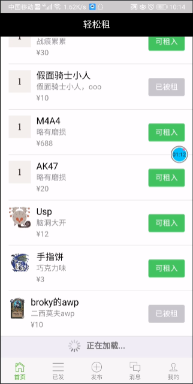
#### 商品详情，可租入、添加收藏、联系发布者
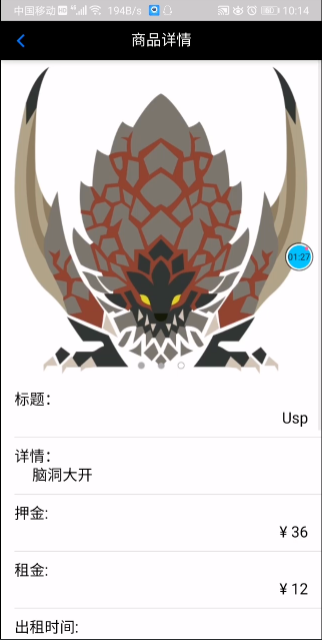
## 发布页面
#### 商品信息输入、支持添加3张图片、日期选择
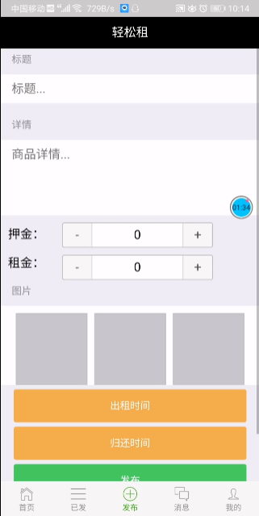
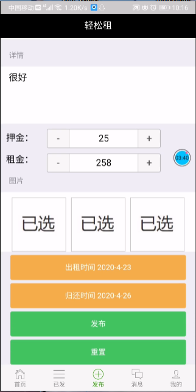
## 已发布商品页面
#### 查看已发布的商品

## 消息页面
#### 获取联系用户列表

## 聊天页面
#### 进行聊天
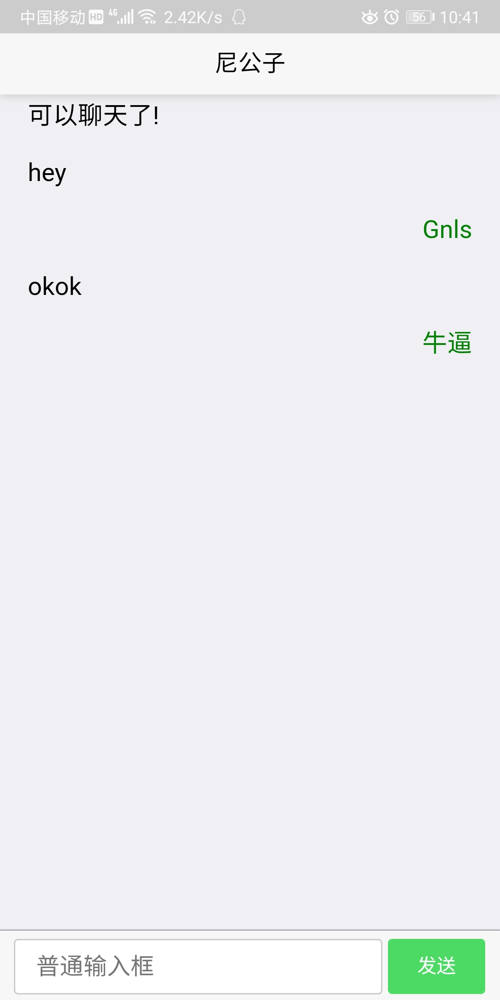
## 个人信息
#### 显示个人信息、收藏夹、全部订单

#### 修改密码

#### 修改个人信息、修改头像
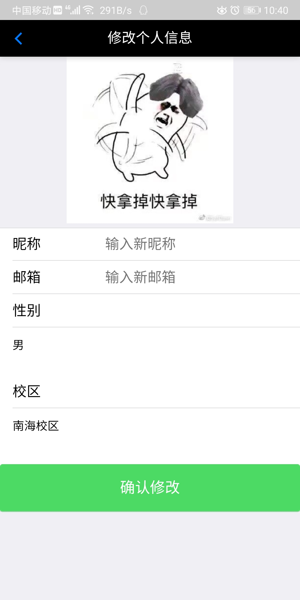
## 订单列表
#### 显示订单列表
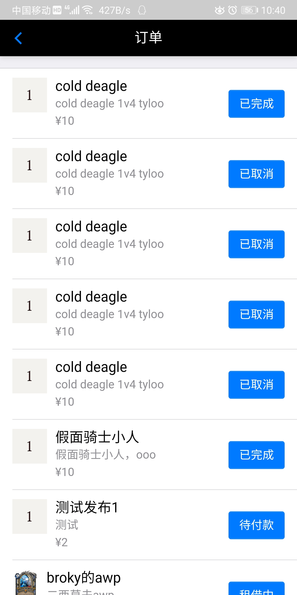
#### 显示订单详情
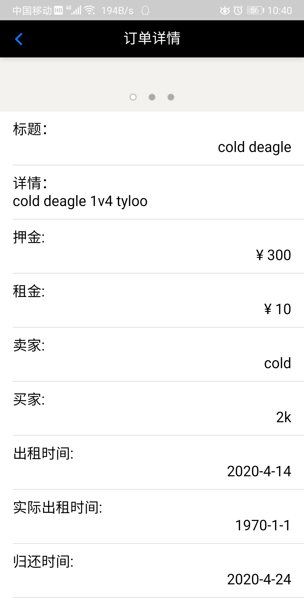
## 收藏夹
#### 添加收藏
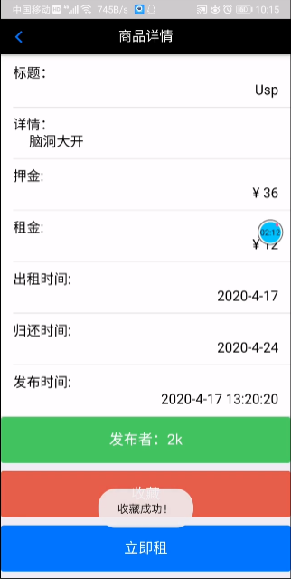
#### 显示收藏夹商品
